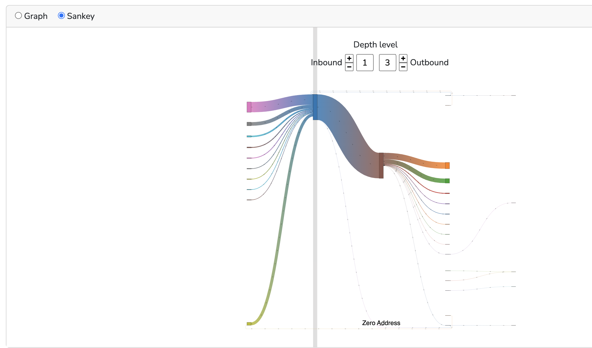

# How to Audit a Dogecoin Wallet

Dogecoin, originally created as a meme cryptocurrency, has grown to be a significant digital asset with a vibrant community. With the increasing adoption of Dogecoin in transactions and investments, there is a rising need to audit Dogecoin wallets for various purposes, including financial reporting, compliance, and forensic investigations. In this blog, we will explore who needs Dogecoin wallet data, the types of data required, and how to audit Dogecoin wallets using Bitquery APIs.

## Who Needs Dogecoin Wallet Data?

Below is the list of individuals or entities who need the DogeCoin Wallet Data.

- Chartered Accountants (CAs): CAs need Dogecoin [wallet data to ensure accurate financial reporting](https://medium.com/coinmonks/cryptocurrency-tracking-for-accountants-f07896f571e2) for businesses and individuals. They verify that the reported cryptocurrency holdings match the actual balances and transactions recorded on the blockchain.

- External Auditors: External auditors may be hired to perform independent audits of an entity's cryptocurrency holdings, including Dogecoin. They validate the existence, completeness, and accuracy of the reported balances and transactions.

- Forensic Accountants: Forensic accountants may investigate cases involving fraud, money laundering, or other illicit activities involving Dogecoin. They trace the flow of funds across multiple wallets to uncover hidden assets or fraudulent transactions.

- Tax Authorities: Tax authorities may request Dogecoin wallet data to verify the accuracy of [income and capital gains](https://bitquery.io/blog/syla-bitquery-crypto-tax-solutions) reports related to cryptocurrency transactions.

- Regulatory Bodies: Regulatory bodies may audit Dogecoin wallets to ensure compliance with anti-money laundering (AML) and know-your-customer (KYC) regulations.

## What Data Do They Need?

Auditing a Dogecoin wallet involves collecting and analyzing various types of data. Below are the key data points required:

### Balances and Address Details

To audit a Dogecoin wallet, the first step is to verify the current balance and its updates over time. Auditors need to ensure that the balance reported by the wallet owner matches the balance recorded on the blockchain. This involves retrieving the wallet's balance at specific dates and comparing it to the reported values.

Auditors can use Bitquery APIs and tools to retrieve the current balance and historical balance updates for a Dogecoin wallet. [Check wallet details](https://ide.bitquery.io/wallet-details-of-an-address) and [balance updates](https://ide.bitquery.io/balance-updates-of-a-wallet_1)  for a specific wallet, that is [DHauk5VWNBu73HhpfKPonwTcFqDEntVGzW](https://explorer.bitquery.io/dogecoin/address/DHauk5VWNBu73HhpfKPonwTcFqDEntVGzW), using the Bitquery IDE. You can see some visual representations for the balance updates and the current balance and account details in the below image.

Figure 1: Visualization of the balance updates and account details

### Client's Trades and Transactions

Understanding a wallet's transaction history is crucial for an accurate audit. Auditors need to review all incoming and outgoing transactions, including trades, payments, and transfers. This helps verify the accuracy of reported transactions and ensures no suspicious or unreported activity. You can use the [Bitquery Explorer](https://explorer.bitquery.io/) to [check the transactions](https://explorer.bitquery.io/dogecoin/address/DHauk5VWNBu73HhpfKPonwTcFqDEntVGzW/transactions) for the wallet mentioned above. 

Figure 2: Transactions of the DHauk5VWNBu73HhpfKPonwTcFqDEntVGzW address

By examining the transaction history, auditors can trace all trades and transfers associated with a Dogecoin wallet. The [transaction history](https://ide.bitquery.io/transaction-details-of-dogecoin-wallet) of the same address, with classification as input transaction and output transaction, can be checked using Bitquery tools to view all transactions or it can also be used to [check each transaction detail](https://ide.bitquery.io/Dogecoin-transaction-details_1) as shown in the image below.

Figure 3: Details of a transaction using transaction hash

## Dogecoin Data for Forensic Investigation 

Forensic accountants often need to trace the flow of Dogecoin across multiple wallets to detect patterns of illicit activities. Bitquery also provides powerful tools and APIs to conduct forensic analysis by visualizing transaction flows and linking related to wallets. Given below is a [money flow](https://explorer.bitquery.io/dogecoin/address/DHauk5VWNBu73HhpfKPonwTcFqDEntVGzW/graph) visualization required in forensics investigation to trace the movement of funds.

Figure 4: Money Flow diagram for the Dogecoin wallet

A forensic accountant might use Bitquery to track Dogecoin transactions across multiple wallets to uncover hidden connections or fraudulent activities. Bitquery's tools help in [tracing transaction flows](https://ide.bitquery.io/dogecoin-wallet-forensics_1) to map out complex transaction networks.

## Conclusion

Auditing a Dogecoin wallet requires a thorough understanding of blockchain data and the right tools to analyze it. Certified Accountants, external auditors, forensic accountants, and regulatory bodies all have a stake in ensuring the integrity of Dogecoin wallets. By leveraging tools like Bitquery, auditors can efficiently access and analyze the necessary data to perform accurate and comprehensive audits.

Understanding the complexities of Dogecoin transactions and balances is key to a successful audit, ensuring transparency and trust in the growing world of cryptocurrency.
